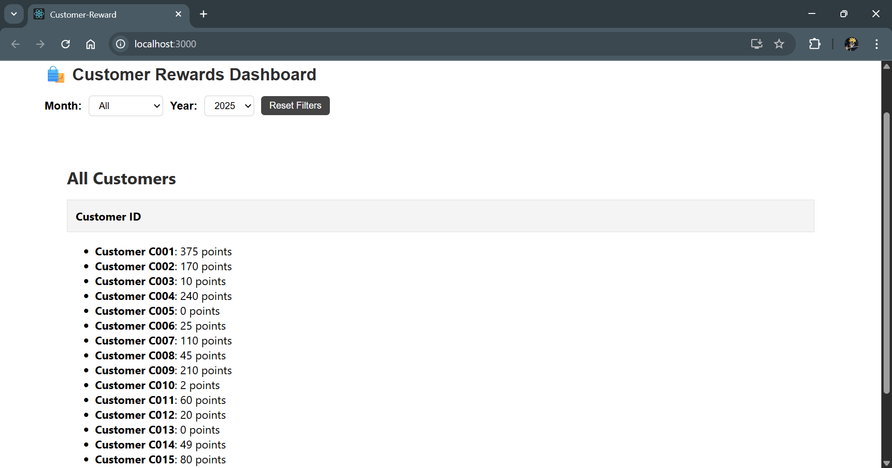
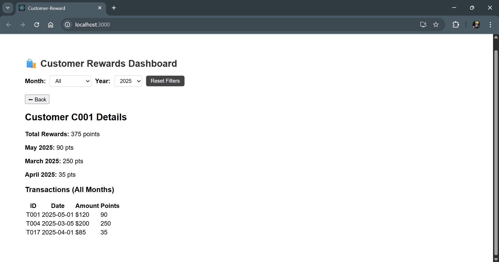
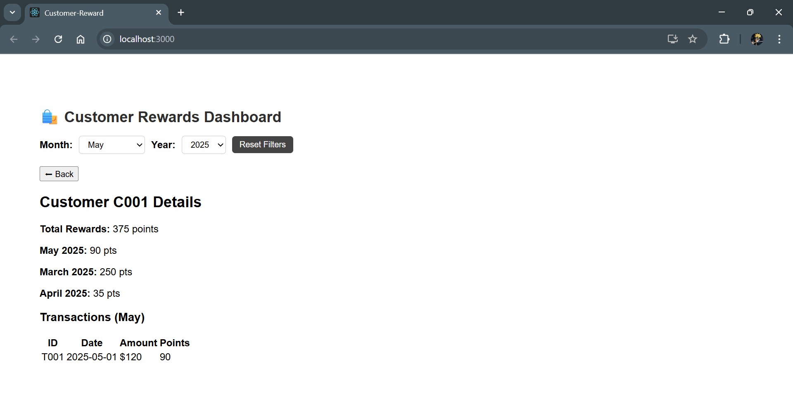

### Customer Rewards

- Run npm install to install all the dependenices
- Run npm start to start the server

👨‍💻 This project shows the rewards earned by a customer.

- On selecting specific month and year from the dropdown and clicking on the customer, its detail are shown.

- Screenshots:

- When a customer is selected without selecting month and year
  

- When month and year is selected and then customer is selected
  
